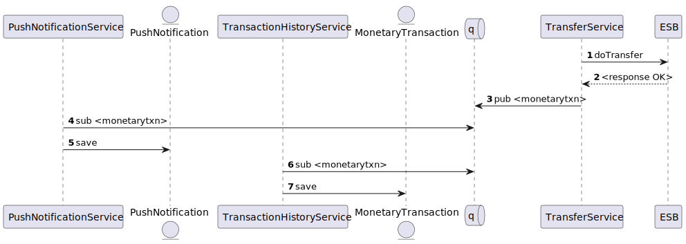

# Tech Specs for [JAMBHALA-2](https://zakiyunus.atlassian.net/browse/JAMBHALA-2)

## Background & research

Normally, a rimaubank customer also has close family members or friends who are also rimaubank customer. This function allows the said rimaubank customer to send money to their family or friends. Extensive usage of this function means that funds stay and increase within rimaubank deposit accounts, maintaining or lowering the bank's cost of funds


## Problem statement

As a rimaubank customer, I would like to do funds transfer from my rimaubank account to another rimaubank account so I can send money to my friends or family

## Goals

-   List goals
    - Customer should need at most 4 steps to transfer money
-   KPIs
    - 1000 intrabank funds transfer between rimaubank accounts per month
    - Total value of IDR 1Mio of funds exchanged between rimaubank accounts per month

## Hypothesis

If we make it frictionless for customers to transfer money online between rimaubank accounts, customers are more likely to recommend their friends and family to open or maintain existing rimaubank account.


## Scope

Explain the solution is, how it works and the extent of the work involved.

1.  Requirements > See [JAMBHALA-2](https://zakiyunus.atlassian.net/browse/JAMBHALA-2)
    - The customer must have a valid rimaubank online banking credentials
    - The source account must have sufficient funds to transfer the money
    - The recepient account must be a valid rimaubank account
    - Upon successful transfer, the sender will receive a notification saying that the transfer to recipient is successful with amount and date
    - When the sender checks their transaction history, the transfer activity must be reflected
2.  Future evolutions
    - There must be a 2nd factor authentication to protect the sender from fraudsters
    - There should be an option for customer to repeat the same transaction
3.  Out of scope
    - Email notification


## Technical solution

### High Level Design
Login should produce an Oauth Token that can be used to call the remaining API's.

There should be 5 main API's representing each test steps
   - Balance Inquiry
   - Account Holder name Inquiry
   - Perform fund transfer
   - Get new push notifications
   - Get transaction history
   

### API Internals

#### 1. Balance Inquiry
````GET /accounts/<account-number>/balance-inquiry````

| Input | Output                                      |
|----- |---------------------------------------------|
|account-number | ````{ accountNumber, availableBalance }```` |

*Security*
 
- Bearer rimaubank JWT token with a valid *custNo* claim

*Http Status*

| Status | Meaning                    |
|--------|----------------------------|
| 200    | Success                    |
| 401    | Invalid Token              |
| 400    | Refer Response Codes below |
| 404    | Account Not found          |

*Response Codes*

| Code | Meaning |
| ---- | ---- |
| 01 | Account Dormant |
| 02 | Account Suspended |
 
*Integrations*
 
| Subsystem | Operation | Endpoint | Purpose                 |
|--------|-------|-------|-------------------------|
| ESB | POST | http://${esb.host-name}:9010/account-service | To get account details  |
 


#### 2. Account Holder Inquiry
````GET /accounts/<account-number>/holder-name````

| Input | Output                                       |
|----- |----------------------------------------------|
|account-number | ````{ accountNumber, accountHolderName }```` |

*Security*
  - Bearer rimaubank JWT token 

*Http Status*

| Status | Meaning                    |
|--------|----------------------------|
| 200    | Success                    |
| 401    | Invalid Token              |
| 400    | Refer Response Codes below |
| 404    | Account Not found          |

*Response Codes*

| Code | Meaning |
| ---- | ---- |
| 01 | Account Dormant |
| 02 | Account Suspended |
 
     
*Integrations*
 
  | Subsystem | Operation | Endpoint | Purpose                 |
  |--------|-------|-------|-------------------------|
  | ESB | POST | http://${esb.host-name}:9010/account-service | To get account details  |
 

#### 3. Perform Intrabank Transfer
````POST /transfer/intrabank```` 


| Input                                                    | Output                                |
|----------------------------------------------------------|---------------------------------------|
| ````{ amount, sourceAccount, destinationAccount, payeeName }```` | ````{ responseCode, responseMsg }```` |

*Security*
  - Bearer rimaubank JWT token with a valid *custNo* claim


*Http Status*

| Status | Meaning                    |
|--------|----------------------------|
| 200    | Success                    |
| 401    | Invalid Token              |
| 400    | Refer Response Codes below |


*Response Codes*

| Code | Meaning             |
| ---- |---------------------|
| 01 | Insufficient Funds  |
| 02 | Transaction Expired |
| 03 | Invalid Amount      |
 
     
*Integrations*
 
  | Subsystem | Operation | Endpoint                                      | Purpose                   |
  |--------|-----------------------------------------------|---------------------------|-------------------------|
  | ESB | POST | http://${esb.host-name}:9010/transfer-service | To perform funds transfer |
 
*Events*  

| Transmitted | Consumed By                                                 |
|----|-------------------------------------------------------------|
| MonetaryTransaction| ````PushNotificationService, TransactionHistoryService ```` |


*Sequence*


#### 4. Get New Push Notifications
````GET /push-notifications/new````

| Input | Output                            |
|----- |-----------------------------------|
| | ````List({ message, isRead })```` |

*Security*
  - Bearer rimaubank JWT token  with a valid *custNo* claim

*Http Status*

| Status | Meaning                    |
|--------|----------------------------|
| 200    | Success                    |
| 401    | Invalid Token              |
| 404    | No new push notifications  |

 
     
*Entities* 

| Entity                                | Operation |
|---------------------------------------|-----------|
| [PushNotification](#pushnotification) | Query     | 


#### 5. Get Transaction History
````GET /transaction-history````

| Input | Output                                                                                                                  |
|----- |-------------------------------------------------------------------------------------------------------------------------|
| | ````List({ txnId, amount, sourceAccount, destinationAccount, payeeName, transactionType, transactionDate, status })```` |

*Security*
  - Bearer rimaubank JWT token  with a valid *custNo* claim


*Http Status*

| Status | Meaning                    |
|--------|----------------------------|
| 200    | Success                    |
| 401    | Invalid Token              |
| 400    | Refer Response Codes below |
| 404    | Account Not found          |

*Response Codes*

| Code | Meaning |
| ---- | ---- |
| 01 | Account Dormant |
| 02 | Account Suspended |
 
     
*Entities* 

| Entity                                      | Operation |
|---------------------------------------------|-----------|
| [MonetaryTransaction](#monetarytransaction) | Query     | 

### Entities

#### PushNotification
- custNo
- message
- isRead

#### MonetaryTransaction
- custNo
- amount
- sourceAccount
- destinationAccount
- payeeName
- transactionType
- transactionDate
- status
 
## Open questions

-   [ ] Should we notify the recipient of the incoming transfer?

          